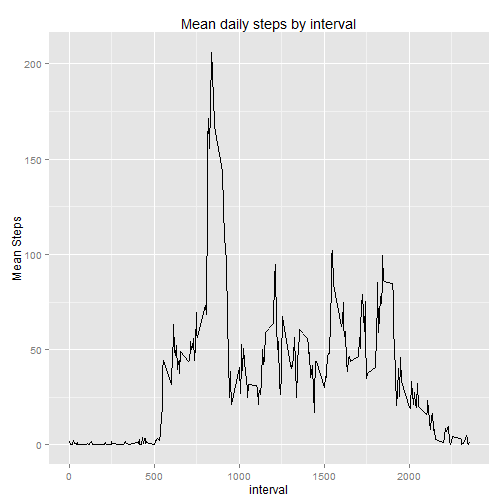

# Reproducible Research: Peer Assessment 1
It is now possible to collect a large amount of data about personal movement using activity monitoring devices such as a Fitbit, Nike Fuelband, or Jawbone Up. These type of devices are part of the "quantified self" movement - a group of enthusiasts who take measurements about themselves regularly to improve their health, to find patterns in their behavior, or because they are tech geeks. But these data remain under-utilized both because the raw data are hard to obtain and there is a lack of statistical methods and software for processing and interpreting the data.

This assignment makes use of data from a personal activity monitoring device. This device collects data at 5 minute intervals through out the day. The data consists of two months of data from an anonymous individual collected during the months of October and November, 2012 and include the number of steps taken in 5 minute intervals each day.

## Loading and preprocessing the data

This assignment requires activity.zip file which can be downloaded from [this location](https://d396qusza40orc.cloudfront.net/repdata%2Fdata%2Factivity.zip).  
We first unzip the file and extract the activity.csv file.  
Then let us take a look at the structure of the csv by using the head function and the summary function.


```r
unzip("activity.zip")
activity <- read.csv("activity.csv")
head(activity)
```

```
##   steps       date interval
## 1    NA 2012-10-01        0
## 2    NA 2012-10-01        5
## 3    NA 2012-10-01       10
## 4    NA 2012-10-01       15
## 5    NA 2012-10-01       20
## 6    NA 2012-10-01       25
```

```r
summary(activity)
```

```
##      steps               date          interval   
##  Min.   :  0.0   2012-10-01:  288   Min.   :   0  
##  1st Qu.:  0.0   2012-10-02:  288   1st Qu.: 589  
##  Median :  0.0   2012-10-03:  288   Median :1178  
##  Mean   : 37.4   2012-10-04:  288   Mean   :1178  
##  3rd Qu.: 12.0   2012-10-05:  288   3rd Qu.:1766  
##  Max.   :806.0   2012-10-06:  288   Max.   :2355  
##  NA's   :2304    (Other)   :15840
```


## What is mean total number of steps taken per day?
For this part of the exercise, we will first sum the number of steps by date omitting the NAs.  
_Please note that NAs are automatically removed by using aggregate function in this form._  

```r
activityByDate <- aggregate(steps ~ date, data = activity, sum)
```

First, we will make a histogram of the total number of steps taken each day.  

```r
hist(activityByDate$steps, col = "red", main = "Histogram of total steps taken daily", 
    xlab = "total steps taken daily")
```

 

Now we will take a mean and median of the resulting data.

```r
activityMean <- mean(activityByDate$steps)
activityMedian <- median(activityByDate$steps)
```


Mean of total number of steps taken each day is **1.0766 &times; 10<sup>4</sup> steps**.  
Median of total number of steps taken each day is **10765 steps**.

## What is the average daily activity pattern?
For this question, we will first take mean of steps by interval.  
Then we will use the *qplot* from *ggplot2* library to draw a *linegraph* of mean steps by interval.  

```r
activityByInterval <- aggregate(steps ~ interval, data = activity, mean)
library(ggplot2)
qplot(interval, steps, data = activityByInterval, geom = c("line"), main = "Mean daily steps by interval", 
    ylab = "Mean Steps")
```

 


Next, we will use the *which* function to find out which daily interval contains the maximum of mean steps.


```r
maxSteps <- max(activityByInterval$steps)
maxStepsInterval <- activityByInterval[which(activityByInterval$steps == maxSteps), 
    1]
```


The daily interval containing maximum number of mean steps (**206.1698 steps**) is **Interval  835**.

## Imputing missing values
First we will find all missing values using *which* function.  


```r
missingIndex <- which(is.na(activity$steps))
missingCount <- nrow(as.array(missingIndex))
```


**We find that 2304 values are missing.**  
  
Next we will replace those missing values by the mean steps of that interval. We have these already calculated in the **activityByInterval**.  
  
Lets call the new data frame as filledActivity.


```r
filledActivity <- activity
# filledActivity$steps[missingIndex] <- activityByInterval[filledActivity$
```


## Are there differences in activity patterns between weekdays and weekends?

