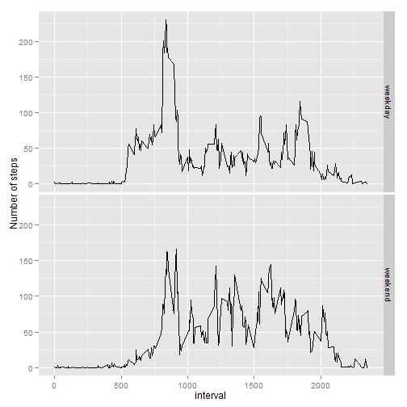

# Reproducible Research: Peer Assessment 1
It is now possible to collect a large amount of data about personal movement using activity monitoring devices such as a Fitbit, Nike Fuelband, or Jawbone Up. These type of devices are part of the "quantified self" movement - a group of enthusiasts who take measurements about themselves regularly to improve their health, to find patterns in their behavior, or because they are tech geeks. But these data remain under-utilized both because the raw data are hard to obtain and there is a lack of statistical methods and software for processing and interpreting the data.

This assignment makes use of data from a personal activity monitoring device. This device collects data at 5 minute intervals through out the day. The data consists of two months of data from an anonymous individual collected during the months of October and November, 2012 and include the number of steps taken in 5 minute intervals each day.

## Loading and preprocessing the data

This assignment requires activity.zip file which can be downloaded from [this location](https://d396qusza40orc.cloudfront.net/repdata%2Fdata%2Factivity.zip).  
We first unzip the file and extract the activity.csv file.  
We will convert the date column to date object.
Then let us take a look at the structure of the csv by using the head function and the summary function.


```r
unzip("activity.zip")
activity <- read.csv("activity.csv")
activity$date <- as.Date(activity$date)
head(activity)
```

```
##   steps       date interval
## 1    NA 2012-10-01        0
## 2    NA 2012-10-01        5
## 3    NA 2012-10-01       10
## 4    NA 2012-10-01       15
## 5    NA 2012-10-01       20
## 6    NA 2012-10-01       25
```

```r
summary(activity)
```

```
##      steps            date               interval   
##  Min.   :  0.0   Min.   :2012-10-01   Min.   :   0  
##  1st Qu.:  0.0   1st Qu.:2012-10-16   1st Qu.: 589  
##  Median :  0.0   Median :2012-10-31   Median :1178  
##  Mean   : 37.4   Mean   :2012-10-31   Mean   :1178  
##  3rd Qu.: 12.0   3rd Qu.:2012-11-15   3rd Qu.:1766  
##  Max.   :806.0   Max.   :2012-11-30   Max.   :2355  
##  NA's   :2304
```


## What is mean total number of steps taken per day?
For this part of the exercise, we will first sum the number of steps by date omitting the NAs.  
_Please note that NAs are automatically removed by using aggregate function in this form._  

```r
activityByDate <- aggregate(steps ~ date, data = activity, sum)
```

First, we will make a histogram of the total number of steps taken each day.  

```r
hist(activityByDate$steps, col = "red", main = "Histogram of total steps taken daily", 
    xlab = "Total steps taken daily")
```

 

Now we will take a mean and median of the resulting data.

```r
activityMean <- mean(activityByDate$steps)
activityMedian <- median(activityByDate$steps)
activityMean
```

```
## [1] 10766
```

```r
activityMedian
```

```
## [1] 10765
```


Mean of total number of steps taken each day is **1.0766 &times; 10<sup>4</sup> steps**.  
Median of total number of steps taken each day is **10765 steps**.

## What is the average daily activity pattern?
For this question, we will first take mean of steps by interval.  
Then we will use the *qplot* from *ggplot2* library to draw a *linegraph* of mean steps by interval.  

```r
activityByInterval <- aggregate(steps ~ interval, data = activity, mean)
library(ggplot2)
qplot(interval, steps, data = activityByInterval, geom = c("line"), main = "Mean daily steps by interval", 
    ylab = "Mean Steps")
```

 


Now, we will find out the maximum number of mean steps in any interval.  

```r
maxSteps <- max(activityByInterval$steps)
maxSteps
```

```
## [1] 206.2
```


Next, we will use the *which* function to find out which daily interval contains the maximum of mean steps.


```r
maxStepsInterval <- activityByInterval$interval[which(activityByInterval$steps == 
    maxSteps)]
maxStepsInterval
```

```
## [1] 835
```


The daily interval containing maximum number of mean steps (**206.1698 steps**) is **Interval  835**.

## Imputing missing values
### Imputing strategy research
First, we will find all missing values using *which* function.  

```r
missingIndex <- which(is.na(activity$steps))
missingCount <- nrow(as.array(missingIndex))
missingCount
```

```
## [1] 2304
```


**We find that 2304 values are missing.**    
Now, we will quickly draw a scatterplot (interval vs date) to see if there is any pattern in missing values.  


```r
qplot(date, interval, data = activity[missingIndex, ], main = "Missing Interval scatterplot", 
    ylab = "Missing Intervals")
```

 


It seems like data is missing for few complete days.  
## Imputing Strategy
### We will replace the *missing values* by the *mean steps* of the corresponding interval. We have these already calculated in the *activityByInterval*.  
  
### Imputation Code
Lets call the new data frame as filledActivity.


```r
filledActivity <- activity
for (i in missingIndex) {
    filledActivity$steps[i] <- activityByInterval$steps[activityByInterval$interval == 
        filledActivity$interval[i]]
}
```


Now, we will redo the following  
1. Aggregation by day  
2. Histogram by day  
3. Mean and Median  

## Histogram (after the filled values)

```r
filledActivityByDate <- aggregate(steps ~ date, data = filledActivity, sum)
hist(filledActivityByDate$steps, col = "red", main = "Histogram of total steps taken daily (filled)", 
    xlab = "Total steps taken daily (filled)")
```

 

```r
filledActivityMean <- mean(filledActivityByDate$steps)
filledActivityMedian <- median(filledActivityByDate$steps)
filledActivityMean
```

```
## [1] 10766
```

```r
filledActivityMedian
```

```
## [1] 10766
```


New Mean of total number of steps taken each day is **1.0766 &times; 10<sup>4</sup> steps** vs Old Mean **1.0766 &times; 10<sup>4</sup> steps**.  
New Median of total number of steps taken each day is **1.0766 &times; 10<sup>4</sup> steps** vs Old Median **10765 steps**.  
  
  
**There was no difference in mean of the total steps taken per day.** This is because the missing data was missing for a few complete days. And we filled the missing data with means across days. Hence there was no impact on the mean.  
However, **the median was shifted** due to more **mean** values being inserted.


## Are there differences in activity patterns between weekdays and weekends?

We will first add a **weekday** column, whose value will be *weekday* for weekdays, and *weekend* for weekends.  
And compute the mean of steps by interval and weekday.  

```r
filledActivity$weekday <- weekdays(filledActivity$date)
filledActivity$weekday[filledActivity$weekday == "Sunday"] <- "weekend"
filledActivity$weekday[filledActivity$weekday == "Saturday"] <- "weekend"
filledActivity$weekday[filledActivity$weekday != "weekend"] <- "weekday"

filledActivityByWeekday <- aggregate(steps ~ interval + weekday, data = filledActivity, 
    mean)
```


Next we will plot a line plot between with interval as x-axis and steps as y-axis and use weekday column as a facet.  

```r
qplot(interval, steps, data = filledActivityByWeekday, facets = weekday ~ ., 
    geom = c("line"), ylab = "Number of steps")
```

 


### Yes, there is visible difference between weekday and weekend activity patterns. Specifically, following are the more observable points of difference:
1. During weekends, **activity is lower** during 0500 hours to 1000 hours
2. During weekends, **activity is higher** during 1000 hours to 1500 hours
3. During weekends, **activity is higher** during 1500 hours to 2000 hours
